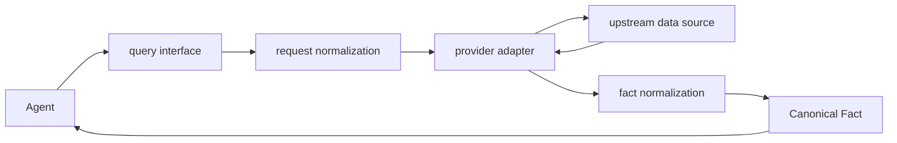

# Architecture — Agent-oriented A-share Facts

## 一个 CLI，一条外部事实链

```text
Agent query interface
        ↓
    Fact modules
        ├─ request normalization
        ├─ provider adapter → upstream source
        ├─ fact normalization
        └─ provenance / freshness / degraded
        ↓
   Canonical Fact
```

Agent query interface 不接触本地数据库或文件缓存。CLI 只通过 provider adapter 转接外部数据源；短期缓存只存在于进程内。

`normalize` 不是 Agent 可调用的 module，也不位于数据源之前或之后的单向层级。Fact module 内部先规范化请求，再调用 adapter，最后把原始响应规范化为 Canonical Fact。



## Module 结构

| Module | Interface | Implementation responsibility |
|---|---|---|
| `agent_cli` | 查询命令、参数、JSON envelope、exit code | 参数转换与输出，不取数、不读本地数据库 |
| `services` | Fact 查询 interface | 完整事实流程与错误、时效、降级策略 |
| `services.market` | Runtime snapshot facts | canonical quote cache、市场宽度、排行、涨跌停与交易日策略 |
| `services.limit_history` | 单票涨停活动历史 | 只从 canonical daily bars 与明确板块规则推导封板、炸板、连板；历史 ST 缺失保持 unavailable |
| `services.reference` | Reference fact schema | dataset mapping、单位、时间、来源与 schema drift |
| `providers` | 上游 adapter seam | transport 与 vendor parsing；原始字段不得穿过 Fact seam |
| `normalize` | Fact module 的内部 implementation | identifier、单位、时间与质量转换 |
| `features` | 可复算 feature sets | 只消费 Canonical bars |

## Runtime snapshot

Runtime snapshot 在写入进程缓存之前完成 quote canonicalization：

- `symbol` 使用 canonical identifier。
- `volume` 是 shares，`amount` 是 CNY，百分比是 percent points。
- vendor `volume_lots` 与 raw row 不得出现在 cross-section/movers interface。
- market width、movers 与 limits 共享同一 Runtime snapshot 时间语义。
- `market ↔ limits` 不允许形成循环调用或动态 import。

## Reference fact

上游数据源只是 adapter，不是公共事实 schema：

- 中文列名、网页字段顺序和 provider query 不穿过 seam。
- 每个 dataset 输出稳定英文 canonical fields。
- raw ratio 在需要时转换为 percent points。
- 未识别 schema 标记 `REFERENCE_SCHEMA_DRIFT` 与 `degraded=true`，不得静默透传。
- 空结果仍返回 dataset、query、units、provenance 与 `records=[]`。

## 无本地数据库

- package 不包含 Release、Universe、Consumer view、pipelines 或 storage module。
- provider adapter 不读取本地票池，也不持久化上游响应。
- security master、Reference fact 与 Runtime snapshot 的缓存均为进程内实现。
- CLI 不提供 `admin`、`universes`、`--release`。

## Provider authority

- TDX：security master、daily bars、intraday、transactions、corporate actions
- Tencent：realtime quotes 与当前开盘集合竞价快照；index 也通过 canonical `quotes` 查询
- Eastmoney：sector identity/membership、sector daily/minute bars、limit pools 与 Reference facts；永不作为 stock/index bars 的静默 fallback

Provider 失败不能静默更换 authority；`degraded=true` 必须向上暴露。

## 禁止依赖

- `agent_cli → providers`
- `features → providers`
- `providers → services`
- package → local database/storage/pipelines
- Runtime snapshot 返回 vendor raw rows
- Reference fact 只返回英文 canonical fields

架构测试扫描 forbidden imports 与退役 module。

## 已退役

- `mcp_server.py`、`cli.py`
- `realtime.py`、`release.py`、`tdx.py`、`views.py`
- `services/limits.py`
- `storage/release_store.py`
- `pipelines/releases.py`
- `releases.py`、`services/universes.py`
- `pipelines/`、`storage/`
- `market indices` convenience command；使用 `quotes SH000001 SH000300 ...`
